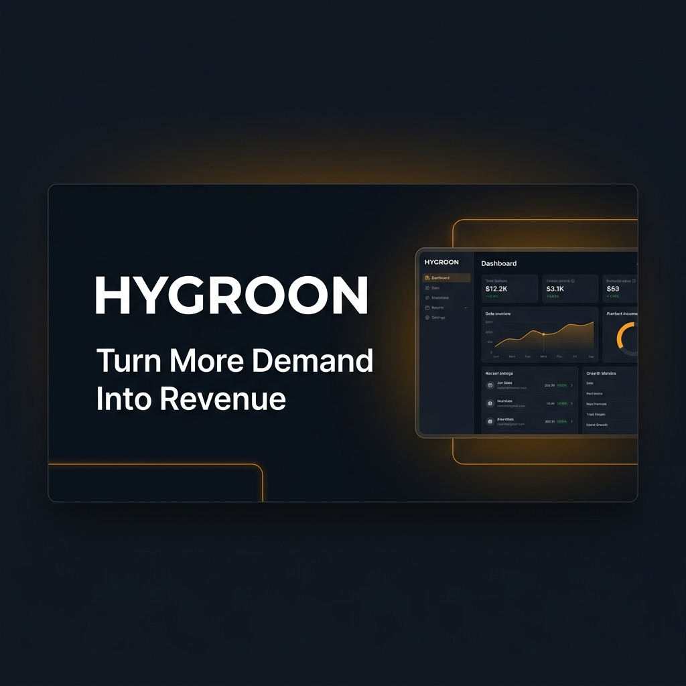

# Hygroon Web: Turn More Enquiries Into Booked Work

<div align="center">



### The Premier Growth Platform & Local SEO Infrastructure for Home Service Contractors

[](https://nextjs.org/)
[](https://react.dev/)
[](https://www.typescriptlang.org/)
[](https://www.indexnow.org/)
[](https://hygroon.com)

[Live Web Platform](https://hygroon.com) • [HVAC Industry Solution](https://hygroon.com/industries/hvac) • [Run 60-Second Diagnostic](https://hygroon.com/analyze) • [Insights Editorial Hub](https://hygroon.com/insights)

</div>

---

## Executive Summary

**Hygroon** is a specialized Local SEO, intake automation, and growth platform engineered specifically for U.S. home-service contractors (HVAC, Basement Waterproofing, Drainage, Water Restoration, Pest Control, Pool Services, Property Maintenance, and Facility Services). 

Most home-service businesses do not suffer from a lack of market demand: they suffer from **demand leakage** across 5 critical stages of the customer journey:

1. **Discovery Leakage**: Missing top local positions in the Google Maps 3-Pack when local distress searches occur.
2. **Website Conversion Leakage**: Mobile UX friction, missing one-tap phone buttons, and slow page loading.
3. **Intake Contact Leakage**: Unanswered calls after 5:00 PM or on weekends dropping into traditional voicemail.
4. **Response Latency Leakage**: Slow call-backs allowing homeowners to contact competing contractors.
5. **Estimate Follow-Up Leakage**: Open replacement quotes ($5k to $15k) sitting without automated follow-up.

Hygroon systematically identifies and seals these leakage points, turning raw search interest into dispatched, revenue-generating service calls.

---

## Primary Platform Pillars

### 1. Local Search Prominence (Google Maps 3-Pack)
- **Hyper-Local Positioning**: Optimized for high-intent emergency service queries (e.g. *"24/7 emergency AC repair near me"*, *"furnace replacement contractor"*, *"foundation repair specialist"*).
- **Google Business Profile (GBP) Authority**: Service area alignment, category optimization, and automated review recency velocity.

### 2. Speed-to-Lead & Missed Call SMS Textback
- **15-Second Automated Response**: When an inbound call goes unanswered after hours or during peak dispatch volume, an automated SMS textback triggers within 15 seconds to initiate two-way service booking before the customer contacts a competitor.

### 3. Interactive Business Growth Diagnostic (`/analyze`)
- **60-Second Audit Engine**: Evaluates local search prominence, review recency, mobile conversion friction, and response speed.
- **Evidence Taxonomy**: Categorizes findings into explicit evidence levels (`OBSERVED`, `CALCULATED`, `INFERRED`, `NEEDS CONFIRMATION`).

### 4. Generative Engine Optimization (GEO & AI Search)
- **AI Search Readiness**: Native support for LLM crawlers via structured manifests (`/public/llms.txt`, `/public/llms-full.txt`).
- **AI Referral Attribution**: Built-in tracking for visitors arriving from generative answer engines (`chatgpt.com`, `claude.ai`, `perplexity.ai`, `searchgpt`).

### 5. Evidence-First Content Architecture (`/insights`)
- **Actionable Industry Research**: Evidence-grounded operational guides targeting U.S. HVAC contractors covering after-hours lead loss, speed-to-lead benchmarks, mobile conversion UX, and Google Maps SEO.

---

## Technical SEO & Structured Data Infrastructure

Hygroon Web is built on a **Search Prominence First** engineering standard:

- **Canonical Domain Enforcement**: Automatic 301 redirection from `www.hygroon.com` to `hygroon.com`.
- **Search & AI Bot Directives (`src/app/robots.ts`)**: Explicitly allows search crawlers and AI bots (`Googlebot`, `Bingbot`, `GPTBot`, `ClaudeBot`, `OAI-SearchBot`) while disallowing token-gated private routes (`/reports/`, `/proposals/`, `/onboarding/`, `/api/`).
- **Dynamic Sitemap Generation (`src/app/sitemap.ts`)**: Programmatically registers all 33 production routes with priority weighting and change frequencies.
- **IndexNow Integration (`src/lib/indexnow.ts`)**: Instant index notification endpoint supporting Bing, Yandex, and compatible engines (`/8f3b4a2c1d9e.txt`).
- **Factually Grounded JSON-LD Schema**:
  - `Organization`: Global entity attributes, brand mark, and official links.
  - `WebSite`: Structure and navigation metadata.
  - `OfferCatalog`: Categorized home-service trade offerings (HVAC, Waterproofing, Drainage, Restoration).
  - `BreadcrumbList`: Dynamic breadcrumb snippet generation on deep sub-pages.
  - `Article`: Schema markup for all editorial research guides.

---

## Repository Architecture

```
hygroon-web/
├── public/
│   ├── 8f3b4a2c1d9e.txt       # IndexNow verification key file
│   ├── llms.txt               # Machine-readable quick index for AI search crawlers
│   ├── llms-full.txt          # Deep service taxonomy & entity context for LLMs
│   ├── og-image.png           # High-resolution social media preview image
│   └── logo.png / logo.svg    # Brand visual identity assets
├── src/
│   ├── app/
│   │   ├── layout.tsx         # Root layout with site-wide JSON-LD schema & tracking
│   │   ├── page.tsx           # Homepage & customer journey overview
│   │   ├── sitemap.ts         # Sitemap generator for search engines
│   │   ├── robots.ts          # Crawler directive rules
│   │   ├── how-it-works/      # 5-stage leakage methodology & evidence taxonomy
│   │   ├── privacy/           # Privacy policy & A2P 10DLC SMS compliance
│   │   ├── terms/             # Terms of service
│   │   ├── analyze/           # 60-second multi-stage business diagnostic tool
│   │   ├── growth-review/     # Consultation request intake
│   │   ├── industries/        # Trade verticals (HVAC, Waterproofing, Drainage, etc.)
│   │   └── insights/          # Evidence-based operational articles & research guides
│   ├── components/            # UI & schema components (Navbar, Footer, BreadcrumbJsonLd)
│   ├── config/                # Brand and market configuration parameters
│   └── lib/                   # Analytics, attribution capture, IndexNow, and diagnostic logic
└── src/**/*.spec.ts           # Automated test suite (60/60 tests passing)
```

---

## Getting Started & Local Development

### Prerequisites
- Node.js 20.x or higher
- npm 10.x or higher

### Installation & Execution

```bash
# 1. Clone the repository
git clone https://github.com/loondx/hygroon-web.git
cd hygroon-web

# 2. Install dependencies
npm install

# 3. Run development server
npm run dev
```

Open [http://localhost:3000](http://localhost:3000) in your browser to view the platform locally.

---

## Verification & Build Validation

Before committing changes, execute the full verification suite:

```bash
# 1. TypeScript compilation check
npm run typecheck

# 2. Run automated test suite (60 smoke & SEO tests)
npm test

# 3. Build standalone production bundle
npm run build
```

---

## Legal & Operational Integrity

Hygroon strictly adheres to plain-language, evidence-based practices:
- **No Fabricated Claims**: Zero fake client reviews, fake case studies, or unverified statistical claims.
- **A2P 10DLC Compliance**: Opt-in transparency and data privacy standard enforcement across all automated SMS workflows.
- **Data Protection**: Strict privacy parameters ensuring client operational data is never sold or repurposed.

---

<div align="center">

**© 2026 Hygroon. All rights reserved.**  
[Website](https://hygroon.com) • [Contact Support](https://hygroon.com/contact) • [Privacy Policy](https://hygroon.com/privacy) • [Terms of Service](https://hygroon.com/terms)

</div>
